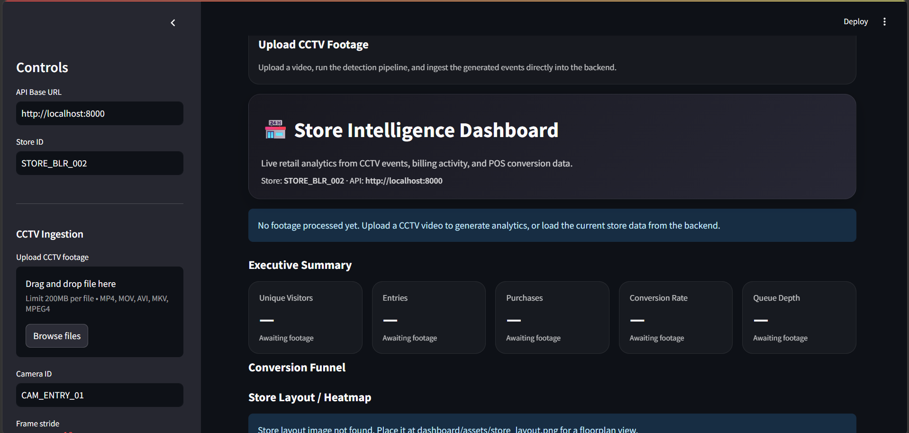
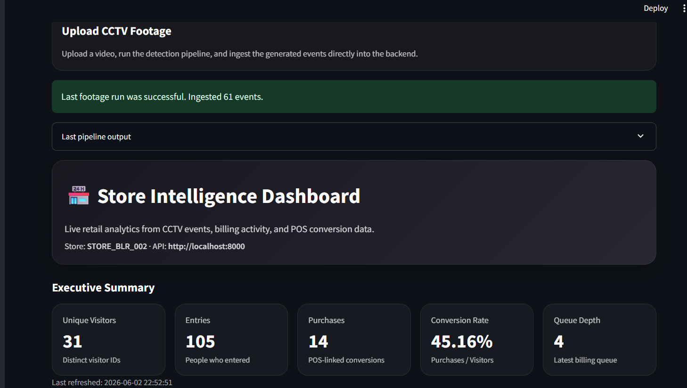

<<<<<<< HEAD
# Purple_Challenge_Project
The system automatically detects customer movement inside a retail store, generates structured events, computes business metrics, detects anomalies, and visualizes store performance through an interactive dashboard.
=======
# 🏪 Store Intelligence System

## Purplle Tech Challenge 2026 Submission

An AI-powered retail analytics platform that converts CCTV footage and POS transaction data into actionable business intelligence.

The system automatically detects customer movement inside a retail store, generates structured events, computes business metrics, detects anomalies, and visualizes store performance through an interactive dashboard.

---

# Problem Statement

Retail stores generate large volumes of CCTV footage and transaction data every day. However, store managers often lack visibility into customer behavior and operational bottlenecks.

This project addresses that challenge by transforming raw CCTV footage and POS data into meaningful retail insights such as:

- Customer footfall
- Zone engagement
- Dwell time analysis
- Queue monitoring
- Conversion funnel analysis
- Operational anomaly detection

---

# Key Features

## 🎥 CCTV Analytics

- YOLO-based person detection
- Multi-object tracking
- Entry detection
- Exit detection
- Zone visit detection
- Dwell time estimation
- Billing queue detection

---

## 📊 Business Metrics

The system computes:

- Unique Visitors
- Entry Count
- Exit Count
- Purchase Count
- Conversion Rate
- Abandonment Rate
- Queue Depth
- Average Dwell Time by Zone

---

## 🔄 Conversion Funnel

Customer journey tracking:

```text
ENTRY
  ↓
ZONE_VISIT
  ↓
BILLING_QUEUE
  ↓
PURCHASE
```

Automatically calculates drop-off percentages between funnel stages.

---

## 🗺️ Heatmap Analytics

Zone-level analytics including:

- Visit Frequency
- Average Dwell Time

Supported zones:

- MAIN_FLOOR
- SKINCARE
- MAKEUP
- BILLING

---

## 🚨 Anomaly Detection

Rule-based anomaly detection engine capable of identifying:

- BILLING_QUEUE_SPIKE
- CONVERSION_DROP
- DEAD_ZONE
- STALE_FEED

---

## 🖥️ Interactive Dashboard

Built using Streamlit.

Features:

- CCTV Footage Upload
- Real-Time Processing
- KPI Cards
- Conversion Funnel Visualization
- Heatmap Analytics
- Anomaly Alerts
- End-to-End Analytics Workflow

---

# System Architecture

```text
                CCTV Footage
                       │
                       ▼
             YOLO Person Detection
                       │
                       ▼
             Multi-Object Tracking
                       │
                       ▼
               Event Generation
                       │
                       ▼
               FastAPI Ingestion
                       │
                       ▼
                SQLite Event Store
                       │
       ┌───────────────┼───────────────┐
       │               │               │
       ▼               ▼               ▼
   Metrics         Funnel         Heatmap
    Engine         Engine          Engine
       │
       ▼
  Anomaly Engine
       │
       ▼
 Streamlit Dashboard


                POS CSV Data
                       │
                       ▼
          Purchase Event Generator
                       │
                       ▼
               FastAPI Ingestion
```

---

# Technology Stack

## Backend

- FastAPI
- SQLAlchemy
- SQLite

## Computer Vision

- OpenCV
- YOLOv8
- PyTorch

## Dashboard

- Streamlit
- Plotly

## Testing

- Pytest

## Deployment

- Docker
- Docker Compose

---

# Project Structure

```text
store_intelligence_starter/

├── app/
│   ├── main.py
│   ├── metrics.py
│   ├── funnel.py
│   ├── heatmap.py
│   ├── anomalies.py
│   ├── models.py
│   └── storage.py
│
├── pipeline/
│   ├── detect.py
│   ├── upload_events.py
│   ├── import_pos.py
│   └── yolo_detector.py
│
├── dashboard/
│   ├── app.py
│   └── assets/
│       └── store_layout.png
│
├── dataset/
├── docs/
│   └── screenshots/
│       ├── login.png
│       └── output.png
│
├── tests/
│
├── docker-compose.yml
├── Dockerfile
├── requirements.txt
└── README.md
```

---

# Dashboard Demonstration

The dashboard supports an end-to-end workflow where users upload CCTV footage and instantly receive retail analytics.

## Initial Dashboard

Users can upload CCTV footage, configure processing parameters, and trigger analytics generation.



---

## Analytics Dashboard Output

After processing footage and ingesting generated events, the dashboard displays:

- Visitor Metrics
- Conversion Rate
- Queue Depth
- Funnel Analytics
- Heatmap Analytics
- Anomaly Detection



---

# Running the System

## Step 1: Start Backend

```bash
docker compose up
```

Backend API:

```text
http://localhost:8000
```

Swagger Documentation:

```text
http://localhost:8000/docs
```

---

## Step 2: Launch Dashboard

```bash
streamlit run dashboard/app.py
```

Dashboard URL:

```text
http://localhost:8501
```

---

## Step 3: Upload CCTV Footage

1. Open the dashboard
2. Upload CCTV footage
3. Configure processing parameters
4. Click **Process and Ingest Footage**
5. Wait for event generation
6. View analytics instantly

---

# API Endpoints

## Health Check

```http
GET /health
```

---

## Event Ingestion

```http
POST /events/ingest
```

---

## Store Metrics

```http
GET /stores/{store_id}/metrics
```

---

## Conversion Funnel

```http
GET /stores/{store_id}/funnel
```

---

## Heatmap Analytics

```http
GET /stores/{store_id}/heatmap
```

---

## Anomaly Detection

```http
GET /stores/{store_id}/anomalies
```

---

# Testing

Run all tests:

```bash
python -m pytest -q
```

Current Status:

```text
6 Passed
0 Failed
```

---

# Design Decisions

## Why Event-Driven Architecture?

All analytics are derived from immutable events.

Benefits:

- Replayability
- Auditability
- Easier Debugging
- Extensible Analytics Pipeline

---

## Why SQLite?

SQLite was selected because:

- Lightweight
- Easy Local Setup
- Minimal Operational Overhead
- Sufficient for Hackathon Scale

For production deployment, SQLite can be replaced with PostgreSQL.

---

## Why Rule-Based Anomalies?

Rule-based anomaly detection provides:

- Transparency
- Explainability
- Easy Configuration
- Low Computational Cost

---

# Scalability Roadmap

The architecture has been intentionally designed for future scalability.

Potential production upgrades include:

- PostgreSQL instead of SQLite
- Kafka-based event streaming
- Redis caching
- DeepSORT / ByteTrack tracking
- Kubernetes deployment
- Multi-camera synchronization
- Real-time analytics processing

---

# Future Improvements

- Real-time camera stream ingestion
- Floorplan-based heatmap overlays
- Cross-camera visitor tracking
- Staff-customer differentiation
- Predictive conversion analytics
- LLM-powered operational recommendations

---

# Outcome

The Store Intelligence System successfully converts raw CCTV footage and POS transactions into actionable retail insights.

The platform provides:

✅ Customer Journey Analytics

✅ Conversion Funnel Analysis

✅ Heatmap Generation

✅ Queue Monitoring

✅ Operational Anomaly Detection

✅ Interactive Dashboard

✅ End-to-End CCTV-to-Analytics Workflow

This demonstrates how computer vision, event-driven architecture, and business analytics can be combined to create a practical retail intelligence solution.
>>>>>>> 81b3b12 (Initial submission for Purplle Tech Challenge 2026)
